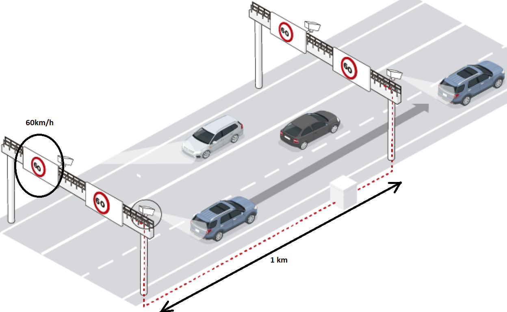
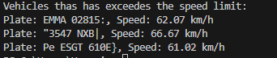

# Traffic Radar Using OCR in Python


### A Data Science Project that simulates a Traffic Radar using Machine Learning

For this project, we will need to be a little bit imaginative. Let's play a role. We've designed and constructed a traffic radar in a specfic area. More specically, it is a section radar. Section radars are composed by two different radars, that take the time of every car at the moment they pass by, and depending on how many time was spend between one picture and another, a traffic ticket may come to the owners house. This is what I'll create today. For the purpose of this project, lets supose that these two radars are separated 1km away from each other, and the seepd limit of the road is 60km/h, as we can see on the picture:



As you can see, what this radars do is to take picture of the vehivles plate, and then mix the data to do their calculations.

With the aim of achieving this project, I created myself a couple of csv files, called ["data_radar_1"](data/raw/data_radar_1.csv) and ["data_radar_2"](data/raw/data_radar_2.csv) representing the pictures taken by every radar. Each line of the csv represents a vehicle, and there's only information about the date and time when the picture was taken, and the image that the radar took at the plate of the vehicle.

In data/images directory, we have the pictures of plates taken from the radars.

From this point we need to detect who's cars have violated the speed limit.

To achieve this project, we devided it in different steps:

## Steps of the project

* Plate Detecting
* Matching information from both radars
* Traffic violation analysis


### Plate detecting 

This step is completed with the [plate_detecting.py](scripts/plate_detecting.py) script. what this script does is generating a function, called "extract_plate_text", that identifies the text of the plate of a car, given an image like this one:


The text taken from this picture is then going to be saved. But this will be in the following step.

### Matching information from both radars

In this step, what we do is take the information from the previously mentioned csv files, and the function "extract_plate_text" created previously, combine it and process it in a new csv file called ["combines_plate_data"](data/processed/combined_plate_data.csv). It is important to mention that this new csv has information of the radar that took the picture. This will be used in the following step.


### Traffic violation analysis

In this final step, what we do is compare between the information of both radars. We have to take into account that the plates are always repeated, more specifically, they appear two times, one for each radar. In case this doesn't happen, this last step isn't done, assuming that the vehicle is still between both radars. Anyway, in those cases when, indeed, both radars detect the same plate, a calculation is done in order to get the speed of the vehicle. If this speed is greater than 60 (km/h), then the script returns the plate and the average speed of the vehicle between these two radars. This is what we see when we run the script:



Finally, the information about all the vehicles, those who had more speed than the limit and those who not, are stored in the [traffic_violation.csv](analysis/traffic_violation.csv). In this CSV we have one row per every plate, and in the last column we can see through a Boolean vlue wether the car that has this plate has commited a traffic volation or not.


## Project file Structure

- `data/`: Contains the original Data (from radars and images) and the processed data
- `data/images/`: all the pictures taken from the radars
- `data/raw/`: initial data from radars 1 and 2.
- `data/processed/`: information processed and combined, yet to determine the speeding violaion
- `scripts/`: Contains the scripts to run the solution. Just to mention, the order of executing should be the following one: 1.-["plate_detcting.py"](scripts/plate_detecting.py), 2.-["csv_processing.py"](scripts/csv_processing.py) 3.-["traffic_violation_analysis.py"](scripts/traffic_violation_analysis.py). 
- `analysis/`: the last csv with information on wether there's a traffic violation or not.
- `aditional_images/`: Images used in the project in any way.


## Installation

- Clone the repository with the following command:
```bash
git clone https://github.com/EnricGarciaMunoz/Traffic_Radar_Python_OCR
```

- Go to the project directory:

```bash
cd Traffic_Radar_Python_OCR
```

- Create a virtual environment (optional but recommended):
```bash
python -m venv venv
```

- Activate virtual environment:
```bash
.\venv\Scripts\activate
```

- Install the dependencies:
```bash
pip install pandas numpy opencv-python pytesseract
```


## Usage

Ensure that the CSV files and images are in the correct folders within the data directory.

Run the CSV processing script:

```bash
python scripts/csv_processing.py
```
Run the traffic violation analysis script:

```bash
python scripts/traffic_violation_analysis.py
```

This will generate a CSV file in the data/analysis directory with detected speed violations.


I hope you finde this project interesting. I strongly encourage you to contact with me if you have any doubt. Thank you!