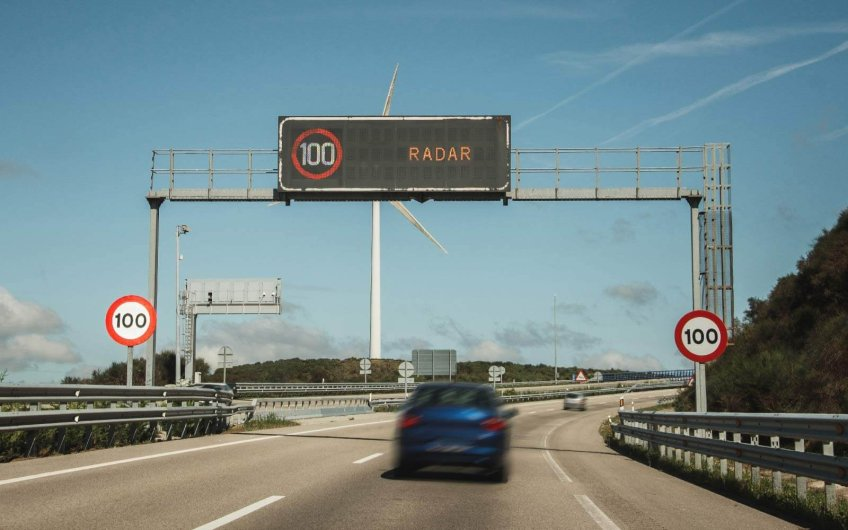

# Traffic Radar Using OCR in Python

### A Data Science Project that simulates a Traffic Radar using Machine Learning

For this project, we will need to be a little bit imaginative. Let's play a role. We've designed and constructed a traffic radar in a specfic area. More specically, it is a section radar. Section radars are composed by two different radars, that take the time of every car at the moment they pass by, and depending on how many time was spend between one picture and another, a traffic ticket may come to the owners house. This is what I'll create today. For the purpose of this project, lets supose that these two radars are separated 1km away from each other, and the seepd limit of the road is 60km/h, as we can see on the picture:

As you can see, what this radars do is to take picture of the vehivles plate, and then mix the data to do their calculations.

With the aim of achieving this project, I created myself a couple of csv files, called ["data_radar_1"](data/raw/data_radar_1.csv) and  representing the pictures taken by every radar. Each line of the csv represents a vehicle, and there's only information about the date and time when the picture was taken, and the image that the radar took at the plate of the vehicle.

In data/images directory, we have the pictures of plates taken from the radars.

From this point we need to detect who's cars have violated the speed limit.

To achieve this project, we devided it in different steps:

## Steps of the project

* Plate Detecting
* Matching information from both radars
* Traffic violation analysis

### Plate detecting 

This step is completed with the [plate_detecting.py](scripts/plate_detecting.py) script. what this script does is generating a function, called "extract_plate_text", that identifies the text of the plate of a car, given an image like this one:

### Data Acquisition

In order to reflect real life projects, I created a Server with a database in wich I store the Data from the csv file. Here attached you can find some images on the server and database creation, and the csv import.

In the report step, I'll connect directly the database, not the csv file.

With this step done, we can advance to Data Analysis.

### Data Analysis

This step solves every one of the business questions. I've split every question in different Queries, so you can inspect every query with its answer.

### Reporting

The aim of this step is to show all the information found in SQL, but in a way that non technical profiles could understand the business performance. It needs to be complete, concise and easy to understand, and at the same time you need to get the big picture of business development and main KPIs with just a quick look.

As mentioned before, I've connected this report directly with the data from the server, as ifwe had a bigger project in terms of data.

You can see the results on the [Pizza_dashboard](report/Pizza_dashboard.pbix) file. This will download the pbix file containing the report.

Anyway, I attach the two main slides as an image:

As you'll see, the relevant information is pretty easy to detect, and we can extract many important insights just having a check. 

## Project file Structure

- `data/`: Contains the original Data
- `sql_queries/`: Contains the SQL queries used to do Data Analytics.
- `business_questions/`: Contains the pdf file with the questions solved suring the project.
- `images/`: Images used in the project in any way.
- `report/`: Contains the pbix file with the final report from our analysis.

I hope you enjoy this project! If you have any doubt, you know you can always contact me!